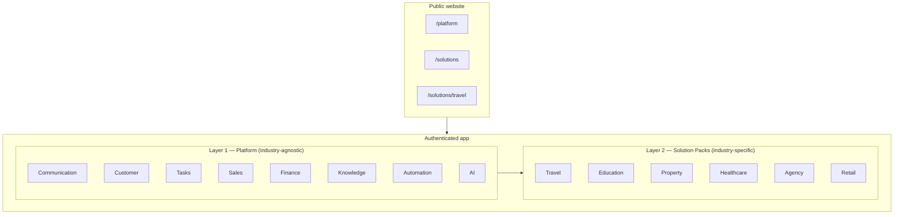

# Desklabs — Product Architecture

**Status:** Architecture reference (no code changes implied)  
**Audience:** Engineering, product, design  
**Purpose:** Establish a shared mental model before refactoring code

---

## Summary

Desklabs is an **AI Customer Operating System** built in two layers:

| Layer | Role | Industry-specific? |
|-------|------|--------------------|
| **Layer 1 — Platform** | Core customer-facing workflow engine | **No** — must stay industry-agnostic |
| **Layer 2 — Solution Packs** | Domain extensions that plug into the platform | **Yes** — one pack per vertical |

**Rule of thumb:** If a feature makes sense for *any* business with customers (travel agency, school, clinic, agency, store), it belongs in **Platform**. If it only makes sense for a specific vertical (e.g. tour manifest, class schedule), it belongs in a **Solution Pack**.

---

## Architecture diagram



**Data flow (conceptual):**

```
Channel message → Communication → Customer record → Task → Sales opportunity → Finance event
                                      ↑                        ↑
                              Knowledge context          Solution Pack entities
                              AI assistance              (Packages, Students, Units, …)
```

---

## Layer 1 — Platform modules

Platform modules define **how work moves** across the customer journey. They must not encode industry nouns in core schemas, routes, or navigation labels beyond generic terms (customer, task, deal, payment).

### Module definitions

| Module | Purpose | Owns (conceptual) | Must NOT own |
|--------|---------|-------------------|--------------|
| **Communication** | Unified inbox across channels | Conversations, threads, channel connections, assignments, reply composer | Industry products (packages, units, classes) |
| **Customer** | Single customer identity & context | Customer profile, timeline, tags, segments, 360° workspace shell | Vertical-specific profile fields (use pack extensions) |
| **Tasks** | Operational queue & daily work | Tasks, priorities, due dates, Today workspace, task sources | Industry workflow definitions (use Automation + packs) |
| **Sales** | Pipeline & revenue motion | Leads, opportunities, stages, quotations, pipeline views | Vertical catalog (packages vs properties vs SKUs) |
| **Finance** | Money tracking in customer context | Payments, invoices, outstanding, milestones linked to customers/deals | Industry pricing rules (pack logic) |
| **Knowledge** | Team knowledge & consistency | Articles, SOPs, scripts, FAQs, internal docs | Industry-only content taxonomy (pack namespaces) |
| **Automation** | Rules that reduce repetitive work | Triggers, task generation, reminders, routing rules | Hard-coded travel/education flows |
| **AI** | Embedded intelligence in workflow | Summaries, intent, suggested replies, next actions, content assist | Vertical models per pack (pack may supply context only) |

### Platform module ownership (engineering)

Each platform module owns:

- **Domain logic** — `lib/<module>/` (e.g. `lib/tasks/`, future `lib/customers/`)
- **Permissions** — `*.view`, `*.create`, `*.edit`, `*.manage` scoped to platform concepts
- **Primary routes** — top-level app paths (see Routing philosophy)
- **Workspace integration** — tabs/panels in Customer Workspace, Today, Inbox sidebars
- **Events** — emits/consumes platform events (e.g. `conversation.received`, `task.created`, `payment.recorded`)

Platform modules **do not** own solution-pack tables or pack-specific nav items.

### Current codebase mapping (as-is → target)

The app today is **Travel-first**. Use this table to plan refactors, not as the target state.

| Platform module | Target ownership | Current implementation (indicative) |
|-----------------|------------------|-------------------------------------|
| Communication | `/inbox` | `app/(dashboard)/inbox/` |
| Customer | `/customers/[id]` workspace | `app/(dashboard)/customers/`, leads as partial stand-in |
| Tasks | `/today` | `app/(dashboard)/today/`, `lib/tasks/` |
| Sales | `/leads`, pipeline | `app/(dashboard)/leads/` |
| Finance | payments, revenue | `app/(dashboard)/revenue/`, booking payment fields |
| Knowledge | `/knowledge` | `app/(dashboard)/knowledge/` |
| Automation | rules engine (future) | Partially: follow-up queue, derived tasks |
| AI | cross-cutting service | `app/api/ai/`, inbox/customer AI panels |

**Leakage to fix over time:** Packages and Bookings live at top-level nav today; architecturally they belong under **Travel Solution Pack**, not Platform.

---

## Layer 2 — Solution Packs

Solution Packs **extend** the platform. They add:

- Domain entities and lifecycle
- Pack-specific UI (lists, detail workspaces, forms)
- Pack-specific automation templates
- Pack-specific knowledge namespaces
- Optional pack-specific AI context (prompts, field mappings)

Packs **reuse** Platform Customer, Communication, Tasks, Sales, Finance, Knowledge, Automation, and AI—they do not fork them.

### Solution Pack catalog

#### Travel (available first)

| Entity | Description | Platform touchpoints |
|--------|-------------|----------------------|
| **Packages** | Sellable tour/product definitions | Sales (quote), Knowledge (itinerary docs) |
| **Bookings** | Confirmed customer trips | Customer timeline, Finance (DP/balance) |
| **Participants** | Travelers on a booking | Customer (linked profiles or sub-records) |
| **Manifest** | Operational departure list | Tasks (prep), Automation (deadline reminders) |
| **Tour Leader** | Staff assignment for departures | Tasks, Customer communication |

#### Education (planned)

| Entity | Platform touchpoints |
|--------|----------------------|
| **Students** | Customer |
| **Enrollment** | Sales pipeline, Finance |
| **Classes** | Tasks, Knowledge |
| **Schedules** | Automation, Communication |

#### Property (planned)

| Entity | Platform touchpoints |
|--------|----------------------|
| **Properties** | Knowledge, Sales |
| **Units** | Sales (inventory interest) |
| **Visits** | Tasks, Communication |
| **Deals** | Sales, Finance |

#### Healthcare (planned)

| Entity | Platform touchpoints |
|--------|----------------------|
| **Patients** | Customer |
| **Appointments** | Tasks, Communication |
| **Treatments** | Sales (packages), Finance |

#### Agency (planned)

| Entity | Platform touchpoints |
|--------|----------------------|
| **Projects** | Sales, Tasks |
| **Clients** | Customer |
| **Invoices** | Finance |

#### Retail (planned)

| Entity | Platform touchpoints |
|--------|----------------------|
| **Products** | Knowledge, Sales |
| **Orders** | Finance, Tasks |
| **Support** | Communication, Tasks |

### Solution Pack ownership (engineering)

Each pack owns:

- **Namespace** — `lib/solutions/<pack>/` and `components/solutions/<pack>/`
- **Database** — tables prefixed or schema-grouped by pack (e.g. `travel_bookings`, or `bookings` with `solution_pack = 'travel'`)
- **Navigation contribution** — registers nav items when pack is enabled for org
- **Routes** — under pack prefix (see Routing philosophy)
- **Marketing** — `/solutions/<pack>` on public site

Packs **must not**:

- Replace platform inbox, customer workspace, or task engine
- Define global permissions that bypass platform RBAC
- Hard-code assumptions about other packs

---

## Navigation ownership

Navigation is split into three surfaces:

### 1. Marketing navigation (public)

Owned by **Marketing / Growth**. Not org-configurable.

| Item | Route | Owner |
|------|-------|-------|
| Platform | `/platform` | Marketing |
| Solutions | `/solutions` | Marketing |
| Resources, Pricing, Company | TBD | Marketing |

Sub-routes like `/platform/communication` and `/solutions/travel` are marketing deep-links; they do not imply app route structure.

### 2. Platform navigation (authenticated)

Owned by **Platform**. Always visible (subject to RBAC).

**Target order (conceptual):**

1. Today (Tasks)
2. Dashboard
3. Inbox (Communication)
4. Customers (Customer)
5. Sales / Leads (Sales)
6. Finance / Revenue (Finance)
7. Knowledge (Knowledge)
8. Automation (Automation) — when shipped
9. Settings

Platform nav labels use **generic language**: Customer, not Passenger; Deal, not Booking (booking is Travel pack).

### 3. Solution Pack navigation (authenticated)

Owned by **each Solution Pack**. Injected **below** core platform items (or grouped under “Travel”, “Education”, …).

**Example — Travel enabled:**

```
Today
Dashboard
Inbox
Customers
Leads
Revenue
Knowledge
─────────────
Travel
  Packages
  Bookings
  Manifest
  Tour Leaders
Settings
```

**Example — Education enabled (future):**

```
… platform items …
─────────────
Education
  Students
  Enrollment
  Classes
  Schedules
Settings
```

### Navigation rules

| Rule | Rationale |
|------|-----------|
| Platform items never rename per industry | One training model, one docs set |
| Pack section title = pack name | Clear ownership boundary |
| Max one level of pack nesting in sidebar | Avoid deep trees |
| Customer Workspace tabs: Platform tabs first, pack tabs after | Consistent shell |
| Disabling a pack hides its nav and routes | Org-level feature flag |

### Current vs target nav

Today `config/navigation.ts` lists **Packages** and **Bookings** alongside platform items. **Target:** move under a **Travel** group registered by the Travel pack.

---

## Routing philosophy

### Namespaces

| Surface | Pattern | Example |
|---------|---------|---------|
| Marketing | `/`, `/platform/*`, `/solutions/*`, `/demo`, `/contact` | `/solutions/travel` |
| Platform app | `/<platform-module>/…` | `/inbox`, `/customers/[id]`, `/today` |
| Solution pack app | `/solutions/<pack>/…` **or** `/<pack>/…` | `/travel/bookings`, `/travel/packages` |

**Recommendation:** Use **`/travel/...`** (short pack slug at root) for authenticated app routes—shorter URLs, clear pack boundary. Reserve `/solutions/travel` for marketing.

Alternative consistent with marketing: **`/app/travel/bookings`** — only if we introduce an `/app` prefix later. **Do not mix** marketing `/solutions/*` and app `/solutions/*` without a layout boundary.

### Proposed authenticated routes

**Platform (stable, industry-agnostic):**

```
/today
/dashboard
/inbox
/inbox/[conversationId]
/customers
/customers/[customerId]
/leads
/leads/kanban
/leads/[leadId]
/revenue
/knowledge
/knowledge/[articleId]
/automation          (future)
/settings/...
```

**Travel pack:**

```
/travel/packages
/travel/packages/[id]
/travel/bookings
/travel/bookings/[id]
/travel/participants
/travel/manifest
/travel/manifest/[departureId]
/travel/tour-leaders
```

**Education pack (future):**

```
/education/students
/education/enrollment
/education/classes
/education/schedules
```

**Property, Healthcare, Agency, Retail:** same pattern — `/<pack-slug>/<entity>/…`

### Routing rules

| Rule | Detail |
|------|--------|
| Platform routes never include pack slug | `/customers/123` not `/travel/customers/123` |
| Pack routes may reference platform IDs | Booking detail links to Customer workspace |
| Permissions checked at platform + pack layer | e.g. `bookings.view` → `travel.bookings.view` over time |
| Legacy routes redirect during migration | `/bookings` → `/travel/bookings` |
| Public routes whitelist explicit paths | No accidental exposure of pack admin UI |

### Deep linking & workspace

- **Customer Workspace** — `/customers/[id]?tab=timeline|tasks|sales|finance|travel` (pack tabs optional query or sub-path)
- **Today** — aggregates platform tasks + open pack tasks (pack supplies task providers)
- **Inbox → Convert** — creates platform Lead/Customer; pack may suggest default pipeline

---

## Naming conventions

### Product language (UI copy)

| Concept | Use | Avoid |
|---------|-----|-------|
| End user of a business | **Customer** | Client (agency), Patient (healthcare) in platform UI |
| Daily work item | **Task** | Todo, Follow-up (as module name) |
| Revenue opportunity | **Lead** / **Deal** | Booking (platform sales) |
| Pack-specific person | Pack term in pack section only | “Passenger” in global nav |

Pack UI **may** use vertical terms inside pack screens (e.g. “Participants” in Travel booking detail).

### Code & database

| Artifact | Convention | Example |
|----------|------------|---------|
| Pack slug | lowercase kebab, single word preferred | `travel`, `education`, `property` |
| Platform lib folder | `lib/<module>/` | `lib/tasks/`, `lib/inbox/` |
| Pack lib folder | `lib/solutions/<pack>/` | `lib/solutions/travel/bookings.ts` |
| Pack components | `components/solutions/<pack>/` | `components/solutions/travel/booking-form.tsx` |
| Permissions (platform) | `<module>.<action>` | `inbox.view`, `tasks.view` |
| Permissions (pack) | `<pack>.<entity>.<action>` | `travel.bookings.edit` |
| DB tables (pack) | `<pack>_<entity>` or `entity` + `pack_id` | `travel_manifests` |
| Events | `<domain>.<verb>` | `booking.confirmed`, `task.created` |
| Marketing content keys | `platformContent`, `solutionsContent` | Already in `lib/marketing/` |

### API & actions

- Server actions: `verbEntityAction` in pack or module actions file — `confirmBookingAction` in `app/travel/bookings/actions.ts`
- Shared AI: platform gateway; pack supplies **context builders** only — `buildTravelBookingContext(bookingId)`

---

## Future scalability

### Org configuration

Each organization has:

```typescript
type OrgProductConfig = {
  enabledPacks: Array<"travel" | "education" | "property" | "healthcare" | "agency" | "retail">;
  primaryPack?: string; // default labels/templates
};
```

- **Single-pack org** — most common; one pack section in nav
- **Multi-pack org** — holding company; multiple pack sections; shared Customer record across packs
- **Platform-only** — possible for CRM-lite; no pack nav

### Extensibility mechanisms

| Mechanism | Use |
|-----------|-----|
| **Customer extension fields** | JSON or EAV per pack on customer record |
| **Task providers** | Packs register derivable tasks (e.g. “manifest due”) |
| **Timeline adapters** | Packs append events to customer timeline |
| **Automation templates** | Pack ships recipes; Automation module executes |
| **Knowledge namespaces** | `/knowledge?pack=travel` or tagged articles |
| **AI context plugins** | Pack registers context for summarization |

### Multi-industry scale

- New pack = new folder + migrations + nav registration + marketing page — **no platform fork**
- Platform releases ship once; packs version independently where needed
- Feature flags per pack for gradual rollout (Education beta, etc.)

### What we explicitly avoid

- Microservices per industry (monolith + modular boundaries first)
- Duplicate inbox/CRM per pack
- Industry-specific platform permissions
- Marketing routes driving app architecture

---

## Decision log (for refactors)

When implementing, prefer these decisions unless a RFC says otherwise:

1. **Bookings and Packages move under Travel** — not platform root nav.
2. **Customer is the hub** — pack entities link to `customer_id`, not replace it.
3. **Tasks stay generic** — pack supplies metadata; task engine stays in `lib/tasks/`.
4. **Finance tracks money** — pack defines *what* is sold; platform tracks *payment state*.
5. **Leads/Sales stays generic** — Travel “inquiry → booking” is a pack playbook on top.
6. **Permissions split** — migrate `bookings.*` → `travel.bookings.*` when pack boundary is coded.

---

## Related documents

| Document | Scope |
|----------|--------|
| [marketing-design-system.md](./marketing-design-system.md) | Public website UI only |
| [SYSTEM_ARCHITECTURE.md](./SYSTEM_ARCHITECTURE.md) | Technical stack, infra, MVP |
| [RFC-0002-task-engine.md](./rfc/RFC-0002-task-engine.md) | Tasks / Today workspace |
| [ROADMAP.md](./ROADMAP.md) | Delivery sequencing |

---

## Acceptance checklist

Before building a feature, engineers should answer:

- [ ] Is this **Platform** or **Solution Pack**?
- [ ] If pack: which pack(s)? Does it need to work when another pack is enabled?
- [ ] Does it introduce industry nouns into platform routes, DB core tables, or global nav?
- [ ] Which module **owns** the logic and permissions?
- [ ] How does it appear on the **Customer timeline** and **Today** queue?
- [ ] What is the **marketing URL** vs **app URL**?

If the answer to the third bullet is “yes” for a pack-only concept, move the feature to the pack layer.

---

*Last updated: product architecture v1 — Desklabs Platform + Solution Packs*
