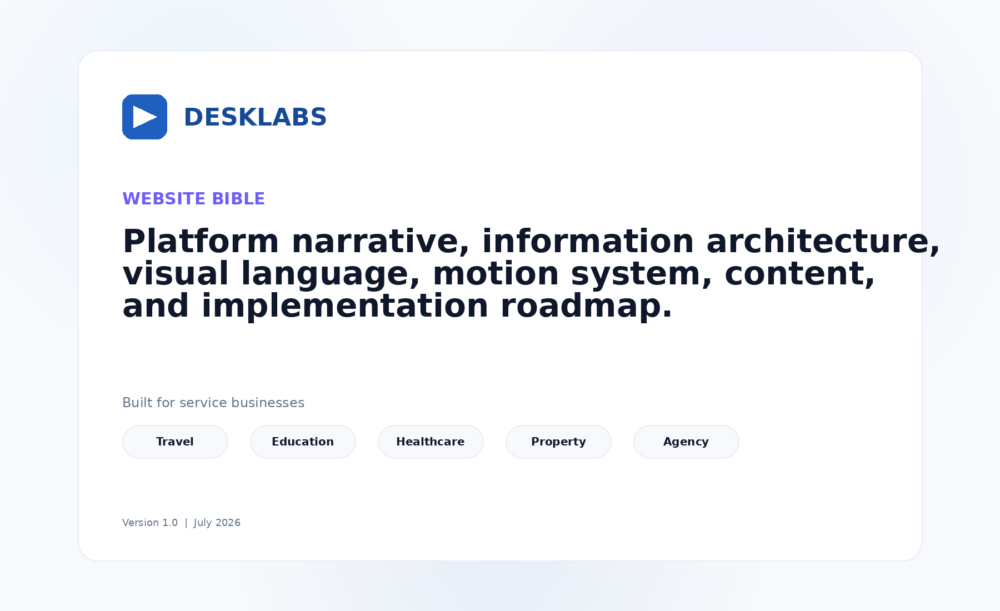
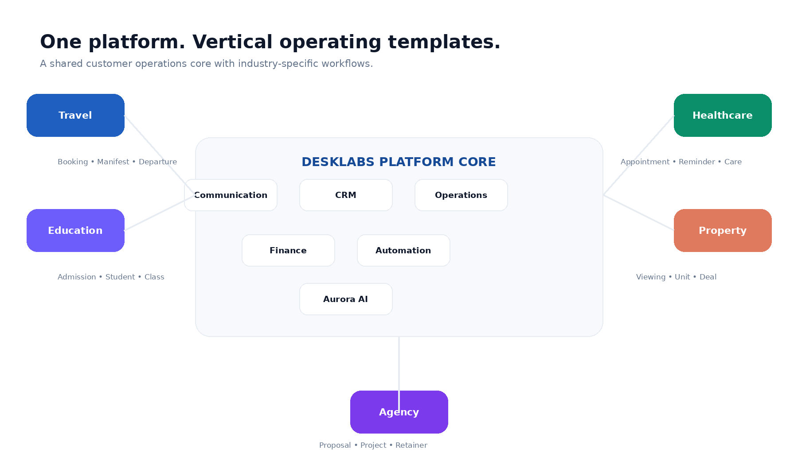
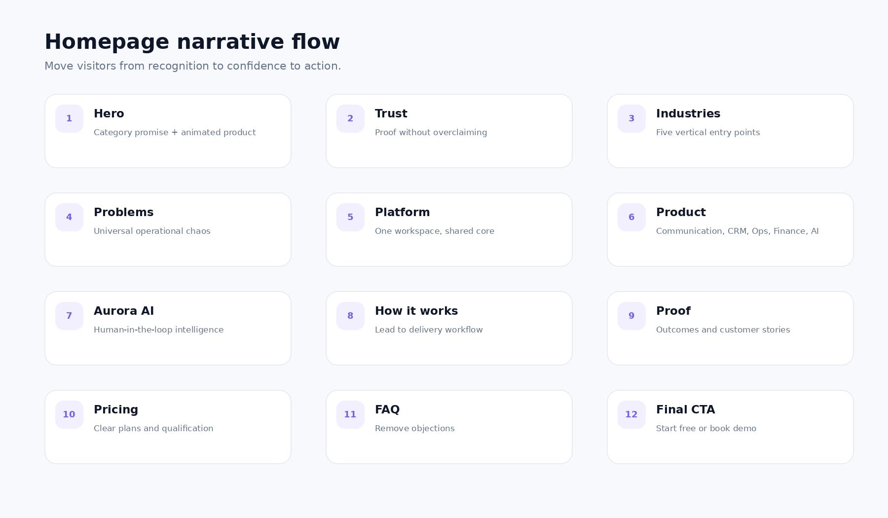
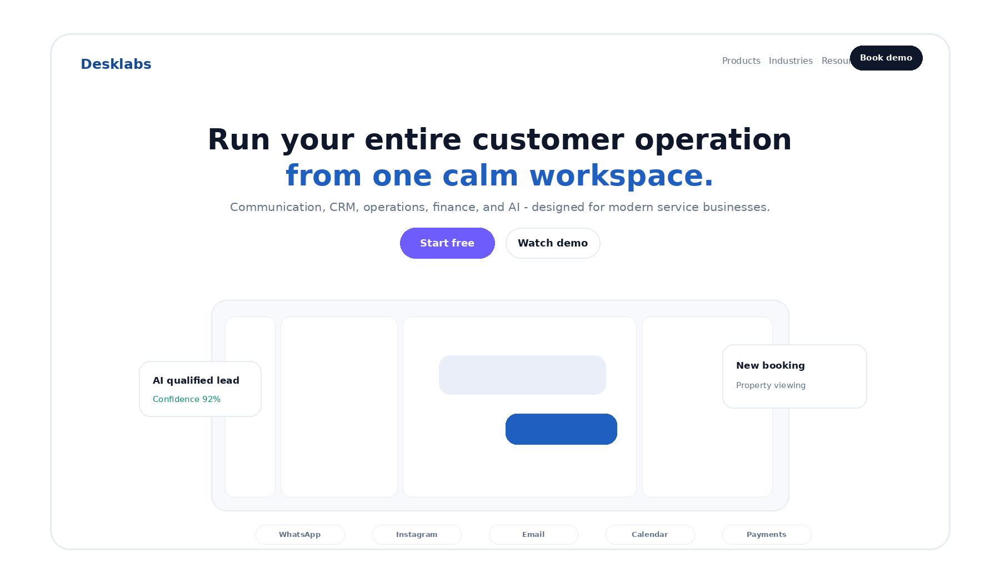
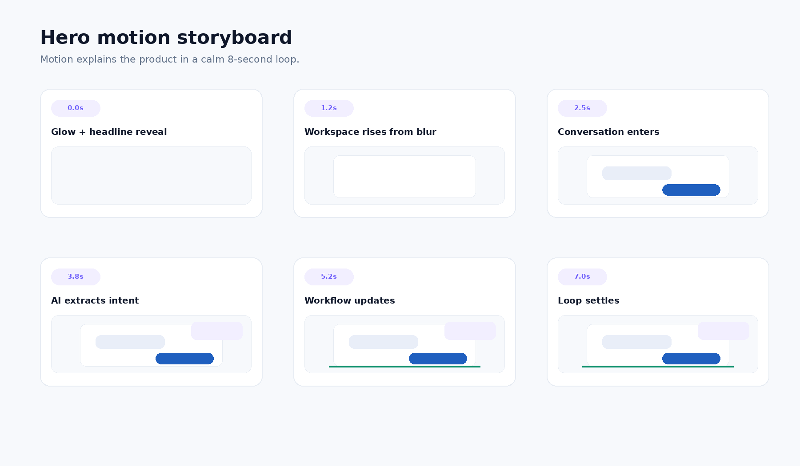
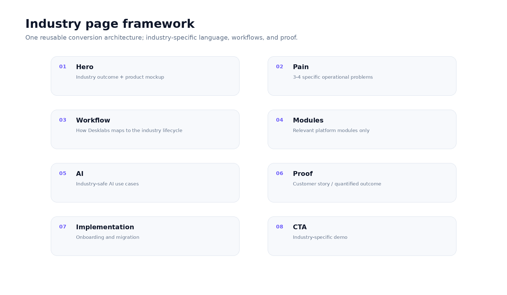
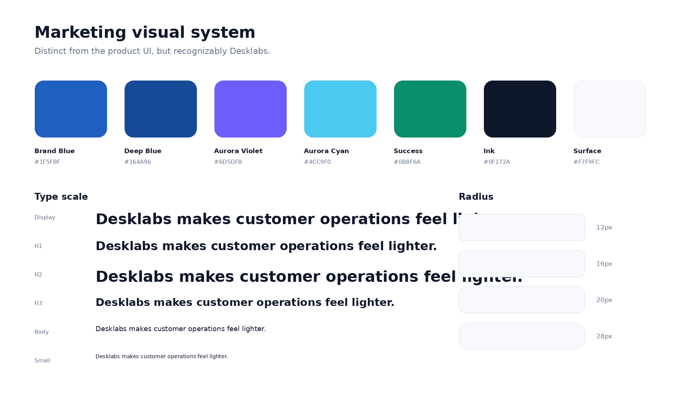
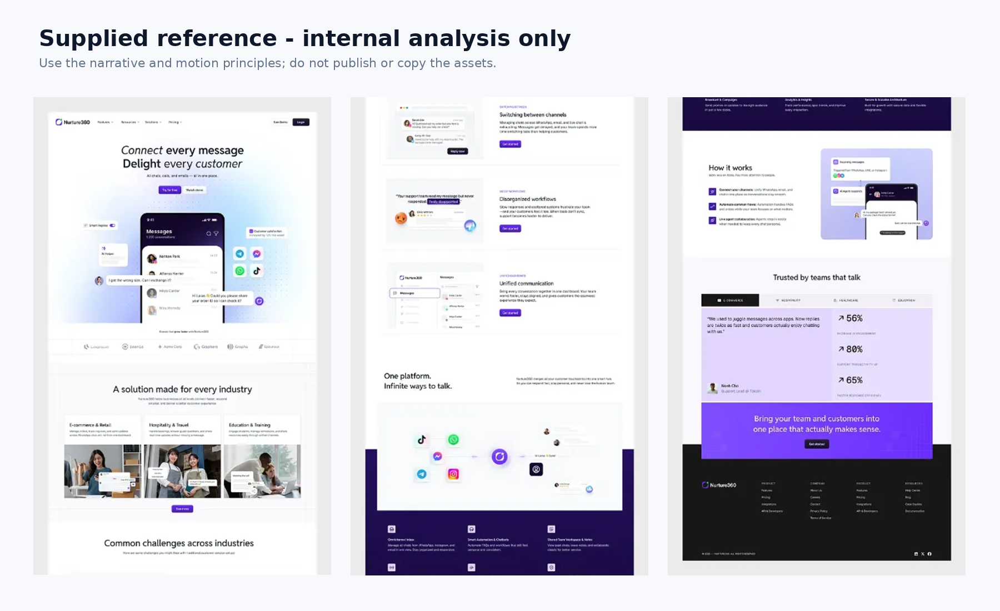

{width=7in}

\newpage

# Contents

1. Executive Summary
2. Strategic Foundation
3. Positioning and Messaging System
4. Website Objectives and Measurement
5. Information Architecture
6. Homepage Blueprint
7. Industry Page System
8. Visual Design System
9. Motion System
10. Visual Asset System
11. Content and SEO System
12. CMS and Content Operations
13. Technical Implementation
14. Analytics and Conversion
15. Accessibility, Privacy, and Trust
16. Delivery Roadmap
17. Governance
18. Reference Analysis
19. Final Recommendation
20. Appendices

\newpage

# Executive Summary

Desklabs should no longer be marketed as a travel-only CRM. The stronger and more scalable category is a **customer operations platform for modern service businesses**: one calm workspace connecting communication, CRM, operational workflows, finance, automation, and human-controlled AI.

Travel remains the beachhead market because the product has real operational knowledge and proof there. The homepage, however, represents the platform. Industry pages translate the same platform core into the language and lifecycle of Travel, Education, Healthcare, Property, and Agency/Professional Services.

The supplied reference is strategically useful because it demonstrates product-led storytelling, clean section rhythm, restrained motion, white space, and an effective progression from category promise to industry relevance, pain recognition, platform explanation, proof, and CTA. Desklabs should adopt those principles while creating original copy, product scenes, assets, visual identity, and motion choreography.

## Recommended category statement

> **Desklabs is the customer operations platform for modern service businesses.**

## Recommended homepage promise

> **Satukan seluruh operasional pelanggan dalam satu workspace.**

## Recommended English promise

> **Run your entire customer operation from one calm workspace.**

## Non-negotiable principles

1. Product visuals do most of the selling.
2. The homepage remains horizontal; industries receive dedicated pages.
3. Every section communicates one idea.
4. AI is human-in-the-loop and contextual.
5. No unsupported product, customer, security, or performance claims.
6. Marketing motion is calm and explanatory.
7. The website must feel like the same brand as the Calm Workspace application.

# 1. Strategic Foundation

## 1.1 The market decision

The user request changes Desklabs from a vertical product into a platform business. That is strategically attractive but introduces a real risk: a website that claims to serve everyone can feel relevant to no one. The solution is not to list more industries in the hero. The solution is a **platform core + vertical operating templates** model.

The shared platform core contains:

- Communication
- CRM
- Operations engine
- Finance
- Automation
- Aurora AI
- Analytics and permissions

Each industry changes the lifecycle, nouns, data templates, automation recipes, and product proof. The homepage sells the shared value. Industry pages sell relevance.

## 1.2 Beachhead versus identity

Travel is the beachhead, not the permanent brand boundary. Travel should remain the first industry page, the source of initial customer stories, and a primary visual dataset during launch. It should not dominate the global headline, navigation, or core product architecture.

## 1.3 Ideal customer profile

Initial horizontal ICP:

- Service businesses with 5-100 employees
- High volume of inbound customer conversations
- Multi-step sales or service lifecycle
- Operations currently coordinated through personal messaging accounts and spreadsheets
- Need for handoff between sales, operations, finance, or service teams
- Strong need for follow-up discipline and customer context

Avoid targeting every small business category. Product-market fit is strongest where communication leads into a structured operational workflow.

## 1.4 Jobs to be done

**When customer conversations arrive through many channels,** teams need one place to understand the customer, decide ownership, and respond without losing context.

**When a lead moves into service delivery,** teams need the conversation, workflow, documents, payment, and activity history to remain connected.

**When managers need visibility,** they need operational truth rather than reports reconstructed from personal chats and spreadsheets.

**When AI is introduced,** teams need it to use real context and remain under human control.

## 1.5 Differentiation

Desklabs is not merely:

- a helpdesk
- a generic CRM
- an AI chatbot
- a project manager
- a finance application

The differentiation is the connected operating model: the same customer context continues from conversation into the industry workflow and commercial outcome.

## 1.6 Strategic risks

### Risk: horizontal dilution

Mitigation: homepage sells universal customer-operations problems; industry pages carry specific workflows and proof.

### Risk: overclaiming product breadth

Mitigation: only show live capabilities or label roadmap clearly. The website should not outrun the product.

### Risk: healthcare compliance exposure

Mitigation: position healthcare around non-clinical communication and coordination until privacy, security, legal, and clinical boundaries are formally established.

### Risk: visual imitation

Mitigation: copy reference principles, not protected expression. Produce original UI scenes and animation.

# 2. Positioning and Messaging System

## 2.1 Messaging hierarchy

### Category

Customer Operations Platform.

### Audience

Modern service businesses.

### Functional promise

Communication, CRM, operations, payments, automation, and AI in one workspace.

### Emotional promise

Work feels calmer. Customer service feels more consistent. Teams lose less context.

### Proof mechanism

Show real product workflows and credible customer outcomes.

## 2.2 Voice and tone

Desklabs should sound:

- clear, not inflated
- confident, not aggressive
- intelligent, not technical for its own sake
- modern, not trendy
- helpful, not robotic
- specific, not crowded with features

Avoid:

- “revolutionary”
- “game-changing”
- “all-in-one” without explanation
- “AI-powered” repeated in every section
- claims of replacing the whole team
- enterprise jargon without operational meaning

## 2.3 Language recommendation

Use Indonesian as the default launch language because the strongest immediate market and sales motion are Indonesian. Publish a professionally edited English version for regional credibility and future expansion. Do not mix languages randomly; retain only familiar product terms such as CRM, workflow, AI, and workspace.

## 2.4 Full copy system

The complete recommended copy is included in `02_Homepage_Copy_Deck.md`. It should be treated as a copy foundation, then refined against actual product capabilities and commercial packaging before launch.

# 3. Website Objectives and Measurement

## 3.1 Primary objectives

1. Establish a clear category and scalable positioning.
2. Demonstrate the product before asking visitors to book a demo.
3. Route visitors into product or industry-specific narratives.
4. Create qualified trial and demo demand.
5. Build trust for a young product without fake proof.

## 3.2 Primary conversions

- Start free
- Book demo
- Watch product demo
- Visit industry page
- View pricing

## 3.3 Success metrics

The primary measure is qualified pipeline or product activation, not raw form volume. Supporting website metrics include CTA click-through, demo-form completion, signup completion, industry-assisted conversion, product-demo engagement, and Core Web Vitals.

# 4. Information Architecture

The site architecture separates horizontal platform pages from vertical conversion pages.

## 4.1 Global navigation

- Products
- Solutions/Industries
- Resources
- Pricing
- Login
- Book Demo

Keep launch navigation simple. Do not expose empty pages to make the product look larger.

## 4.2 Core routes

See the detailed sitemap in `03_Information_Architecture_and_Wireframes.md`.

## 4.3 Homepage narrative

The homepage progresses through:

1. Category promise
2. Trust signal
3. Industry recognition
4. Universal operational pain
5. Shared platform explanation
6. Product capability
7. Aurora AI
8. Workflow
9. Proof
10. Pricing and objections
11. Final action

# 5. Homepage Blueprint

## 5.1 Navigation

The navigation should remain visually quiet. A transparent or white initial state is acceptable; after scrolling, it becomes a white sticky header with a subtle border. The primary demo CTA is compact and does not dominate the hero.

## 5.2 Hero

### Goal

Within eight seconds, visitors should understand what Desklabs is, who it is for, and why it matters.

### Required content

- Category eyebrow
- One outcome-led headline
- Two-sentence maximum supporting copy
- Start Free and Watch/Book Demo
- Product-led visual
- Optional trust microcopy

### Visual story

Use a desktop Desklabs workspace because the product is a work operating system. The scene should be neutral enough for multiple industries while showing concrete actions: a conversation, customer context, Aurora insight, and workflow change.

### Motion

Use the storyboard below; play once and settle.

## 5.3 Trust

Never fabricate logos. If customer proof is limited, use an honest statement, partner/integration categories, and later replace them with approved customer logos and quantified outcomes.

## 5.4 Industries

The five industry cards communicate that Desklabs understands different operating lifecycles without changing the shared platform story. Travel should be first at launch because it has the strongest product authenticity, not because it defines the platform.

## 5.5 Problems

Use four alternating product stories:

1. Scattered conversations
2. Fragmented customer data
3. Missed follow-up
4. Disconnected operations

Each story has one visual problem, one consequence, and one resolved product state.

## 5.6 Platform core

This is the strategic bridge between horizontal positioning and vertical relevance. Show that the same communication, CRM, operations, finance, automation, and AI core can load different operating templates.

## 5.7 Product modules

Present six modules. Limit each module to an outcome statement and one product scene. Detailed capability lists belong on product pages.

## 5.8 Omnichannel and integrations

Show channels in the context of a customer record, not as a decorative logo cloud. Separate live integrations from planned ones.

## 5.9 Aurora AI

Aurora must be demonstrated as a controlled assistant. The website should show sources, reasoning cues where appropriate, confidence carefully, and explicit human approval.

## 5.10 How it works

The flow is universal:

Connect → Understand → Operate → Assist → Improve.

Industry pages replace it with a specific lifecycle.

## 5.11 Proof

Strong proof options, in priority order:

1. Real quantified customer outcomes
2. Customer story with implementation detail
3. Real product usage or operational volume
4. Founder/customer interview evidence
5. Technology or partner ecosystem

Do not publish invented percentages.

## 5.12 Pricing

Pricing should communicate how the product scales. The likely commercial dimensions are seats, channels, automation volume, AI usage, and vertical modules. Final cards must reflect actual packaging.

## 5.13 FAQ

Answer integration support, onboarding, migration, AI control, security, industry fit, pricing, and support.

## 5.14 Final CTA and footer

Repeat the two primary actions. The footer should remain compact and include trust/legal pages before enterprise outreach.

# 6. Industry Page System

The detailed pages for Travel, Education, Healthcare, Property, and Agency are specified in `06_Industry_Page_Frameworks.md`.

## 6.1 Core rule

Do not simply replace nouns in the same copy. Each page must use a real lifecycle, specific pains, relevant modules, realistic product visuals, industry objections, and safe claims.

## 6.2 Launch order

1. Travel
2. Agency
3. Education
4. Property
5. Healthcare after compliance/product readiness

# 7. Visual Design System

## 7.1 Brand direction

The application is a Calm Workspace. The marketing site can use more expressive composition and subtle glows, but must retain the same sense of clarity and control.

### Core palette

- Brand Blue for trust and platform identity
- Aurora Violet for intelligence and automation
- Cyan for connected motion and highlights
- Emerald for positive operational states
- Neutral ink and off-white surfaces for most of the page

Do not adopt the reference’s exact purple identity.

## 7.2 Typography

Recommended families: Geist, Inter, or a comparably neutral variable sans. Use a single family at launch. Headlines depend on weight, tracking, and line break quality rather than a novelty font.

- Display: 64-72 desktop
- H1: 56-64
- H2: 40-48
- H3: 26-30
- Body large: 18
- Body: 16
- Small: 14
- Caption: 12

Mobile sizes use fluid clamp values.

## 7.3 Spacing and layout

- Maximum content width: 1240px
- Desktop gutter: 32px
- Tablet gutter: 24px
- Mobile gutter: 20px
- Standard desktop section spacing: 112-128px
- Mobile section spacing: 64-80px

## 7.4 Radius, border, and shadow

Marketing may use larger radius and softer shadow than the application, but consistency is required. Use radius 12/16/20/28. Borders stay at 6-9% black opacity. Shadows are wide and low-opacity, never the main separator.

## 7.5 Gradients

Gradients are reserved for:

- hero atmosphere
- one platform/AI narrative transition
- final CTA

Do not apply gradient backgrounds to every card.

# 8. Motion System

The complete specification is in `04_Motion_and_Interaction_Spec.md`.

## 8.1 Principle

Motion must explain what changed and how different parts of the customer operation connect.

## 8.2 Reduced motion

Reduced-motion is a full design state, not a technical afterthought. Every product sequence must have a clear static final composition.

## 8.3 Performance

Prefer DOM/SVG, transforms, and opacity. WebGL is not required for the approved direction.

# 9. Visual Asset System

The complete production brief is in `05_Visual_Asset_Production_Brief.md`.

## 9.1 Required asset priority

1. Hero product scene
2. Hero floating callouts
3. Five industry card scenes
4. Four problem/solution scenes
5. Product module scenes
6. Aurora sequence
7. Proof/customer story visuals
8. Social and open-graph assets

## 9.2 Data realism

Use plausible, fictional records. Do not expose real customer data. Do not show a perfect “demo fantasy” where every workflow is complete; real operational states create credibility.

# 10. Content and SEO System

The full copy deck is included in `02_Homepage_Copy_Deck.md`, while SEO, CMS, analytics, and experimentation are detailed in `07_SEO_CMS_Analytics.md`.

## 10.1 Content principle

Lead with outcomes and workflow, then provide features as evidence. Avoid feature dumping.

## 10.2 SEO principle

Build topical authority across platform, product, industry, and problem pages. The homepage should not attempt to rank for every vertical-specific keyword.

# 11. CMS and Content Operations

The CMS manages copy, SEO, FAQs, industry pages, resources, and proof. Complex product animation configuration should remain in code unless an editor genuinely needs to change it.

The machine-readable suggested schema is in `12_cms_content_model.json`.

# 12. Technical Implementation

The detailed architecture is in `08_Technical_Implementation_Plan.md`.

## 12.1 Recommended approach

Build a strong static homepage first. Add complex motion only after content, layout, and responsiveness are approved. This avoids polishing animation around an unstable story.

## 12.2 Performance budget

- LCP < 2.5s target
- INP < 200ms target
- CLS < 0.1
- Static server-rendered hero first frame
- Initial homepage transfer under 2MB where achievable

## 12.3 Localization

Indonesian default plus `/en`. Keep all text out of raster assets.

# 13. Analytics and Conversion

Track the full path from acquisition to qualified pipeline and activation. Do not judge the website only on demo-form count.

Primary events and experiments are listed in `07_SEO_CMS_Analytics.md`.

# 14. Accessibility, Privacy, and Trust

Accessibility and reduced motion are design requirements. Privacy and trust pages are product-sales infrastructure, not footer formalities.

Healthcare requires a separate readiness review. Until then, keep all claims within approved non-clinical operations.

# 15. Delivery Roadmap

## Phase 0 - Approval

- Positioning
- language strategy
- homepage narrative
- visual direction
- claim inventory

## Phase 1 - Foundations

- Figma marketing system
- Next.js marketing shell
- tokens
- navigation/footer
- content model
- analytics plan

## Phase 2 - Static homepage

Implement and approve all sections without complex motion.

## Phase 3 - Visual assets and motion

Hero, problem stories, platform diagram, Aurora sequence, responsive crops.

## Phase 4 - Conversion routes

Demo, pricing, product pages, Travel page.

## Phase 5 - Localization and vertical expansion

English, Agency, Education, Property, Healthcare when ready.

## Phase 6 - Optimization

Proof, experiments, SEO resources, performance refinement.

# 16. Governance

## 16.1 Decision hierarchy

When tradeoffs occur, prioritize:

1. Accuracy and trust
2. Clear category story
3. Product understanding
4. Conversion
5. Visual novelty

## 16.2 Ownership

- Founder/Product: positioning, product accuracy, roadmap claims
- Marketing: copy, campaigns, proof, SEO
- Design: visual system, assets, motion
- Engineering: implementation, accessibility, performance
- Security/Legal: privacy, claims, healthcare readiness

## 16.3 Change control

Major changes to hero positioning, page structure, visual system, or AI claims require a documented revision to this Bible. Small campaign experiments can run within approved guardrails.

# 17. Reference Analysis

The supplied reference demonstrates excellent product-led storytelling. Desklabs should adopt its clarity, rhythm, restrained motion, and visual proof while remaining original.

{width=7in}

Internal extracted frames are included only for design analysis. They must not be published.

# 18. Final Recommendation

Build the website as a **marketing operating system**, not a single landing page. The homepage defines the platform. Product pages explain capabilities. Industry pages create relevance. Customer stories create proof. Resources build demand. A shared design and content system keeps the whole experience coherent as Desklabs expands beyond Travel.

The best immediate launch scope is:

- Platform homepage
- Travel industry page
- Communication and CRM product pages
- Pricing or qualified demo page
- Indonesian default
- English version shortly after

Do not delay launch for all five industry pages, but design the system so they can be added without redesigning the homepage.

# Appendices

## Appendix A - Package files

See `00_README.md` for the complete artifact index.

## Appendix B - Machine-readable assets

- `11_design_tokens.json`
- `12_cms_content_model.json`
- `13_marketing_tokens.css`
- `15_Launch_Backlog.csv`

## Appendix C - Implementation prompts

Use `09_Cursor_Prompt_Pack.md` one PR at a time. Do not generate the entire website in one Cursor run.

## Appendix D - Launch gate

The final checklist is in `10_QA_and_Launch_Checklist.md`.
